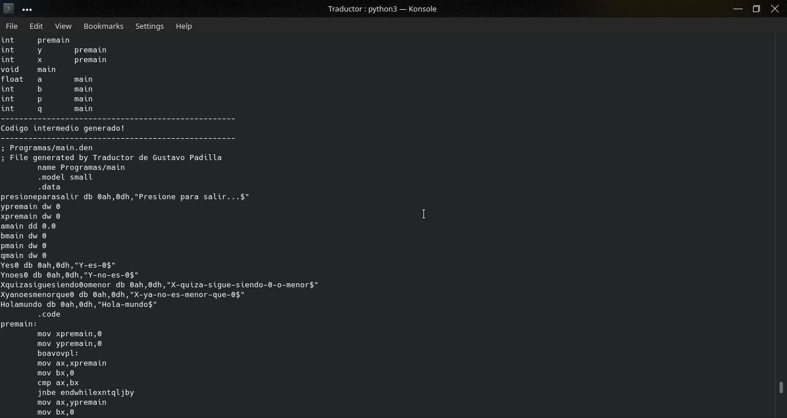
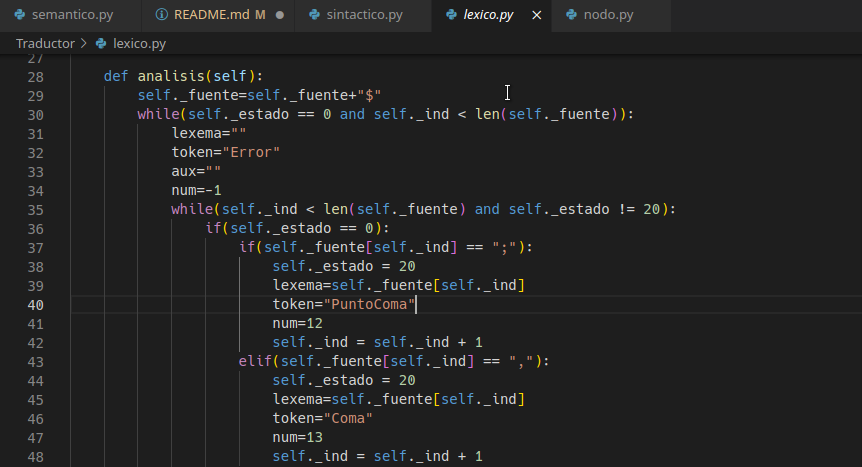
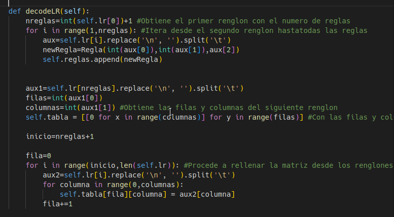
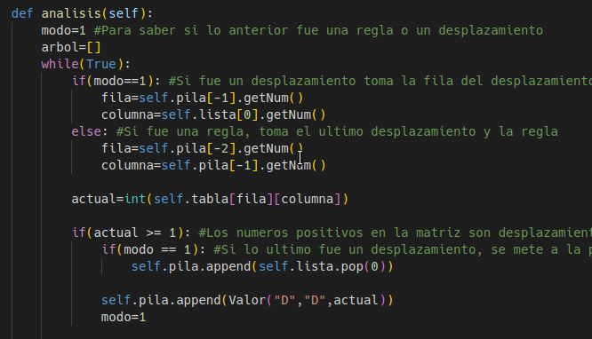
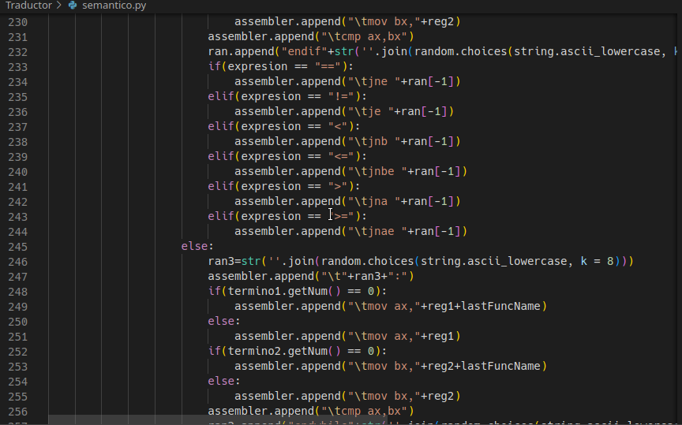
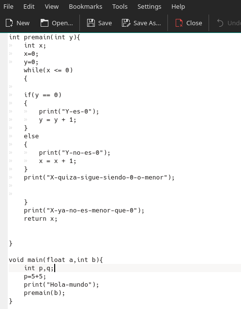
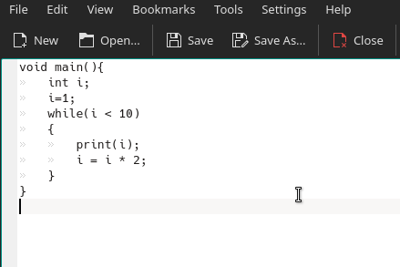

# Compilador/Traductor por **Gustavo Padilla V.**
Proyecto de Seminario de Solución de Traductores de Lenguaje 2, Analizador lexico, sintactico, semantico, generación intermedia y MASM compiler.

## Instrucciones para uso de traductor
- Instalar python 3.6+
- Instalar easygui en python (pip install easygui)
- Ejecutar ./Traductor/traductor.py

### Traductor.py
Se encarga de ser la interfaz principal en consola, aqui se mandaran a llamar los metodos para todo el analisis y la generacion de codigo. Este abre los archivo y los lee, y comienza el analisis pasandole la informacion al analizador lexico, tambien lee el archivo lr para posteriormente mandarle la informacion al analizador sintactico. Ademas, aqui se muestra toda la informacion de los analisis y el codigo ASM al final.

### Lexico.py
Es una clase el cual recibira una cadena que sera todo el programa a leer, y ademas tendra un indice, y estado. Este sera un automata que entrara en un bucle mientras haya caracteres que leer en la cadena recibida, posteriormente leera el caracter y dependiendo de que caracter sea, cambiara la variable de estado a otro numero, le asignara su token, lexema y tipo, y creara su valor con la clase Valor y lo cambiara al estado 20, el cual saldra del while y asi se agregara a una lista de Valores, iniciando otra vez con el automata reiniciando su estado a 0. Algo bastante similar se realiza con los lexemas como (&&) donde cuando se encuentra uno, se verifica que el siguiente sea correcto.En el caso de que sean caracteres alfa-numericos o un guion (-), o se leera completamente hasta que se encuentre otro caracter y se anadira como su token un ID, posteriormente se recorrera la lista buscando todos los de token ID para comparar si es una palabra reservada o un tipo de dato.

### Valor.py
Esta sera la clase que guarde un valor, su token, lexema y tipo, tendra sus seters y geters y se podra crear una cadena de el.

### Sintactico.py
Esta clase se encarga primero de cargar todas las reglas en una lista de reglas al leer el archivo y llenar la tabla LR para el posterior analisis.

El algoritmo del analisis es muy simple,tiene un modo y una lista que simula ser un arbol, entra a un while infinito donde se obtiene el elemento de la pila de, que inicialmente tendra un Valor auxiliar con tipo 0, el tipo sera el entero con el que el algoritmo verifique el analisis, tambien dependiendo del modo se obtendra el primer elemento de la lista de valores obtenido del lexico, si esta en modo 1 que significara que lo ultimo fue un desplazamiento, la fila sera la pila y la columna el primero de la lista de lexico, en otro caso la fila sera el penultimo de la pila y la columna el ultimo de la pila, de esta manera, con la matriz cargada se obtiene el numero con la fila y columna, si es positivo es un desplazamiento, y se apila el primero de la lista de lexico si esta en modo 1, y en cualquier modo se apila el numero actual. 

Si es negativo sera una regla, se obtendra su numero real, la longitud multiplicada por dos para desapilar y el nombre, posteriormente se crea un nodo y se empiezan a desapilar los valores, si el token es diferente de R y D, al nodo se le anade a su lista de terminales el elemento desapilado. Luego verifica el numero de la regla y en base a esto, toma el arbol, y desapila del arbol simulado y se los anade al nodo actual.

Para finalizar se le pone el numero de la regla y se anade al nodo al arbol. Y regresa al arbol.

### Regla.py
Esta clase solo contiene el ID de la regla, la longitud al momento de sacar elementos de la pila y el nombre de la regla.

### Nodo.py
Esta clase sera para generar el arbol de los nodos de cada regla, tendra una lista de no terminales, que sera una lista de nodos, y una lista de terminales que sera una lista de cadenas y el numero de la regla actual del nodo, tendra metodos para obtener la lista de terminales y no terminales, recorrerse, y anadir terminales, no terminales y la regla.

### Semantico.py
Esta clase recibe un nodo que sera la raiz, este tendra una funcion de analisis y preanalisis, la de analisis se manda a llamar en el traductor, y adentro del analisis se llama la funcion preanalisis, esta funcion se llamara recursivamente al recorrerse cada nodo, empezara desde la raiz y este va leer la regla y en base a esta regla, ejecutara codigo para poder verificar todo error desde que una variable no este declarada, ya lo este, no sean del mismo tipo y contexto de declaracion y al usarse.

 Para esto crea un Tabsim donde se iran guardando las declaraciones y su contexto en base a esto varios metodos verifican los errores y a su vez se va generando el codigo intermedio en assembler, si es una suma hace add, si entra en un if o while hace cmp y jmp en base a que tipo son.

Al final regresa el Tabsim y el codigo generado en assembly como listas al traductor.

## Instrucciones para uso de MASM compiler
- Copiar carpeta MASM dentro de la raiz de C:
- Añadir la varable de entorno a Path C:\MASM\BIN
- Ejecutar en cmd: ml [mi_archivo.asm]
- Correr .exe en un CPU de 32 bits
- O correr ASM en un simulador de 8086

### Ejemplo de main.den

### Ejemplo de while.den

